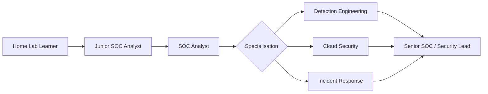

# Career Pathway

## Primary pathway — Junior SOC Analyst → SOC Analyst

This pathway matches the supplied profile and assessment most closely. The immediate goal is employability in security operations, followed by deeper detection, incident response and SIEM ownership.

### Entry capability target

Nkateko should be able to:

- explain the purpose and workflow of a SOC;
- triage common endpoint, authentication and network alerts;
- investigate Windows security events using a repeatable method;
- use Wazuh dashboards, agents, alerts and rule concepts confidently;
- document investigation evidence and conclusions clearly;
- map important activity to MITRE ATT&CK where useful;
- distinguish benign activity, suspicious activity and confirmed incidents;
- escalate with the right context instead of forwarding raw alerts;
- use GitHub to publish sanitised lab evidence and investigation notes.

## Secondary pathway — Detection Engineering / Cloud Security

The assessment identifies SIEM platforms and AI as areas of interest, while the professional profile highlights cloud security. Once the SOC foundation is reliable, the roadmap introduces detection engineering and cloud-control concepts.

### Development signals

- comfortable writing simple Wazuh rules or detection logic;
- understands false positives and detection tuning;
- can explain identity, logging, least privilege and monitoring controls in cloud environments;
- can automate basic evidence-processing or reporting tasks;
- can connect threat behaviour to telemetry requirements.

## Long-term pathway — Security Operations Leadership

Nkateko's assessment states a long-term ambition to attain leadership and create a positive work environment. Leadership development therefore begins early through communication, documentation, mentoring habits and evidence ownership rather than waiting for a management title.

### Long-term evidence

- leads or facilitates a small security improvement project;
- produces an operational runbook used by others;
- presents a security finding to technical and non-technical audiences;
- mentors a newer learner or explains a lab to peers;
- proposes measurable SOC improvements;
- demonstrates consistent professional communication and follow-through.

## Career progression map

## Role-selection rule

The first 90 days should remain broad enough to build employable SOC fundamentals. At the Day-90 review, use portfolio evidence and mentor feedback to decide which specialisation deserves more weight.
